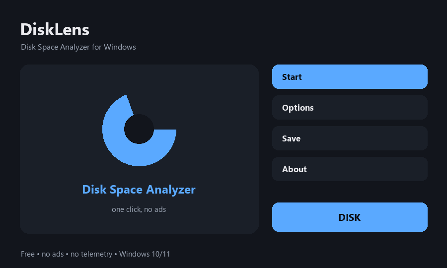

# DiskLens — Disk Space Analyzer for Windows

Free disk space analyzer for Windows - find what fills your drive

**[⬇ Download for Windows](../../releases/latest)** — free, no ads, no account, no sign-up. One small file, unzip and run.

## What it does

- Scan any drive or folder and sort items by real size
- Folder sizes are summed from everything inside them
- Clean, readable list - biggest space hog on top
- No installer bloat, runs on low-end machines
- Read-only: it never deletes anything on its own
- Free and open source, no ads and no telemetry

## How to use

1. Open DiskLens.
2. Press Browse and pick a drive or folder.
3. Press Scan - every item is listed with its real size, biggest first.
4. Folder sizes include everything inside them, so you see the true space hog.

## Requirements

Windows 10 or 11, 64-bit. No admin rights needed and nothing is written to the registry. It runs fine on weak, old and budget machines.

## Privacy

Everything happens on your PC. Nothing is uploaded, there is no telemetry, no ads and no account.

## Licence

MIT — free to use, free to share.
